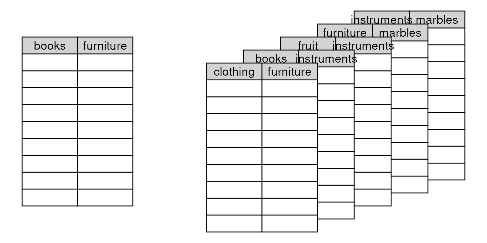

# MultiFactor

## Overview

`MultiFactor` aims to provide a consistent toolkit to incorporate
relational data into data-analytical tools and methods. In practice, we
expect `MultiFactor` to be used in combination with additional packages
that extend it. For instance, see
[ariadne](https://github.com/minotau-R/ariadne) and
[anansi](https://github.com/thomazbastiaanssen/anansi), two such
packages that make use of `MultiFactor` to link and convert across
biological database IDs and perform multi-omics integration analysis,
respectively.

## Get started using MultiFactor

### Installation instructions

Get the latest stable `R` release from
[CRAN](http://cran.r-project.org/). Then install the released version of
`MultiFactor`:

``` r

install.packages("MultiFactor")
```

Or install the development version from this repository:

``` r

install.packages("remotes")
remotes::install_github("minotau-R/MultiFactor")
```

### Setup

``` r

library(MultiFactor)
#> 
#> Attaching package: 'MultiFactor'
#> The following object is masked from 'package:base':
#> 
#>     nlevels
library(ggplot2)
library(dplyr)
#> 
#> Attaching package: 'dplyr'
#> The following objects are masked from 'package:stats':
#> 
#>     filter, lag
#> The following objects are masked from 'package:base':
#> 
#>     intersect, setdiff, setequal, union

# Load demo data
set.seed(2612)
tp <- trade_posts()
```

## MultiFactor and LinkMap objects

### LinkMap

The basic object in the `MultiFactor` package is the `LinkMap`, which
contains relational information across two types of features. This
format is sometimes referred to as an [edge
list](https://en.wikipedia.org/wiki/Edge_list). Under a thin layer of
S7, the `LinkMap` object is a `data.frame` where the first two columns
indicate which feature IDs that are considered linked. Optional
additional columns are considered metadata.

Let’s use an example data set to take a closer look at `LinkMap`. The
[`trade_posts()`](https://minotau-r.github.io/MultiFactor/reference/randomMultiFactor.md)
function generates data about fictional trade posts, where one type of
good is traded for another. In this particular case, types of books are
traded for types of furniture.

``` r

linkmap <- tp[[1]]
linkmap
#>          books furniture
#> 3     red book     couch
#> 2   green book   cabinet
#> 6   plain book   cabinet
#> 4    blue book  wastebin
#> 6.1 plain book  wastebin
#> 4.1  blue book       box
#> 6.2 plain book       box
#> 1   fancy book      door
#> 4.2  blue book      door
```

The two types of goods are captured by the two columns, with column
names representing the *types* of good and rows representing which
specific *type-pairs* are traded at that trade post, or, more generally,
are linked in that `LinkMap`.

``` r

levels( linkmap )
#> $books
#> [1] "blue book"   "fancy book"  "green book"  "plain book"  "red book"   
#> [6] "orange book"
#> 
#> $furniture
#> [1] "box"      "cabinet"  "couch"    "door"     "wastebin" "bed"
```

Notice that `LinkMap` is two `factor` columns in a trench coat. We can
inspect the levels as usual.

We can see that we have several of these types of trade posts in our
data set. However, we also notice that the column names - the types of
goods - can differ.

``` r

tp[[2]]
#>     clothing furniture
#> 6      scarf     couch
#> 6.1    scarf   cabinet
#> 4     gloves  wastebin
#> 5        hat  wastebin
#> 6.2    scarf  wastebin
#> 2      dress       bed
#> 1    t-shirt       box
#> 6.3    scarf       box
#> 5.1      hat      door
tp[[3]]
#>           books instruments
#> 2    green book     trumpet
#> 3      red book      guitar
#> 4     blue book      guitar
#> 4.1   blue book        drum
#> 2.1  green book    keyboard
#> 5   orange book    keyboard
#> 3.1    red book      fiddle
#> 5.1 orange book   saxophone
#> 6    plain book   saxophone
```

#### Visual representation of the LinkMaps in our data set.



### MultiFactor

The `MultiFactor` is in essence a collection of `LinkMap`s. Where
`LinkMap`s contain relational information across two data types,
`MultiFactor`s are a representation of the relational graph formed by
combining those `LinkMaps`. The full object `tp`, which contains the
`LinkMaps` we just investigated, is in fact a `MultiFactor` object:

``` r

tp
#> A MultiFactor::MultiFactor list S7_object,
#>     6 feature types across 6 LinkMaps.
#> 
#>                     books furniture clothing instruments fruit marbles
#> books2furniture         5         5        .           .     .       .
#> clothing2furniture      .         6        5           .     .       .
#> books2instruments       5         .        .           6     .       .
#> fruit2instruments       .         .        .           6     5       .
#> furniture2marbles       .         5        .           .     .       6
#> instruments2marbles     .         .        .           5     .       4
#> 
#> Values represent unique feature names in that LinkMap.
#> 
#> Levels:
#> books       : 6 Levels: blue book ... orange book 
#> furniture   : 6 Levels: box ... bed 
#> clothing    : 5 Levels: dress ... t-shirt 
#> instruments : 6 Levels: drum ... trumpet 
#> fruit       : 5 Levels: apples ... pears 
#> marbles     : 6 Levels: 8 marble ... white marble
```

Notice that a `MultiFactor` summarizes information across the component
`LinkMaps` in several ways. First, The matrix shows the types of goods
as columns and the component `LinkMaps` that contain this information as
rows. The numbers in the matrix then show the number of unique types of
that type of good in that particular `LinkMap` - and that are therefore
linked to the second feature in the `LinkMap`.

For instance, in the top-left corner of the matrix, we can see that the
first `LinkMap` links books and furniture and is aptly named
`books2furniture`. Notice that five unique types of books as well as
five types of furniture are mentioned in `books2furniture`.

Though `MultiFactor` is a list of `LinkMap`s under the hood, we can also
interact with its matrix representation, as well as access the component
levels:

``` r

dim(tp)
#> [1] 6 6
dimnames(tp)
#> [[1]]
#> [1] "books2furniture"     "clothing2furniture"  "books2instruments"  
#> [4] "fruit2instruments"   "furniture2marbles"   "instruments2marbles"
#> 
#> [[2]]
#> [1] "books"       "furniture"   "clothing"    "instruments" "fruit"      
#> [6] "marbles"
levels(tp)
#> $books
#> [1] "blue book"   "fancy book"  "green book"  "plain book"  "red book"   
#> [6] "orange book"
#> 
#> $furniture
#> [1] "box"      "cabinet"  "couch"    "door"     "wastebin" "bed"     
#> 
#> $clothing
#> [1] "dress"   "gloves"  "hat"     "scarf"   "t-shirt"
#> 
#> $instruments
#> [1] "drum"      "fiddle"    "guitar"    "keyboard"  "saxophone" "trumpet"  
#> 
#> $fruit
#> [1] "apples"  "grapes"  "melons"  "oranges" "pears"  
#> 
#> $marbles
#> [1] "8 marble"       "black marble"   "blue marble"    "red marble"    
#> [5] "sparkly marble" "white marble"
lengths(levels(tp))
#>       books   furniture    clothing instruments       fruit     marbles 
#>           6           6           5           6           5           6
```

Note that levels of the same type are automatically unified across all
component LinkMaps with that type of level.

## weave() a path

Going back to our trading post example, let’s say we’d want to get some
new hats, but we only have fruit. While both fruit and clothing are
available in our data set, there aren’t any trade post that deals in
that particular pair of goods. However, we could imagine trading our
fruit for clothing in steps: We can trade our fruit for a different
good, which we trade for another one, until we reach a good that we can
trade for clothing. The
[`weave()`](https://minotau-r.github.io/MultiFactor/reference/weave-generic.md)
function does exactly this:

``` r

fruit2clothing <- weave(tp, fruit ~ clothing)
fruit2clothing
#>      fruit clothing
#> 1   apples   gloves
#> 2    pears   gloves
#> 3   apples      hat
#> 4    pears      hat
#> 5   apples    scarf
#> 6   grapes    scarf
#> 7   melons    scarf
#> 8  oranges    scarf
#> 9    pears    scarf
#> 10  apples  t-shirt
#> 11   pears  t-shirt
#> 12  apples    dress
#> 13  grapes    dress
#> 14  melons    dress
#> 15 oranges    dress
#> 17  grapes      hat
#> 18  melons      hat
#> 19 oranges      hat
```

We receive a new `LinkMap` containing all fruits that could be traded
for clothing.

### Selecting a path

We can use
[`select_path()`](https://minotau-r.github.io/MultiFactor/reference/select_path.md)
to find the types of traded goods in order, or more generally, the paths
that were traversed. If several paths exist, all will be traversed and
included into one `LinkMap`.

``` r

select_path(tp, fruit ~ clothing)
#> [[1]]
#> [1] "fruit"       "instruments" "books"       "furniture"   "clothing"   
#> 
#> [[2]]
#> [1] "fruit"       "instruments" "marbles"     "furniture"   "clothing"
```

## Compatibility with `igraph` and `Matrix`

### Convert `MultiFactor` and `LinkMap` objects to `igraph` representation

`MultiFactor` relies heavily on the excellent
[`igraph`](https://r.igraph.org/) and
[`Matrix`](https://matrix.r-forge.r-project.org/) packages, particularly
for path finding and sparse matrix representation.

#### Convert `MultiFactor` main graph representation to `igraph` object

``` r

library(igraph)
#> 
#> Attaching package: 'igraph'
#> The following objects are masked from 'package:dplyr':
#> 
#>     as_data_frame, groups, union
#> The following objects are masked from 'package:stats':
#> 
#>     decompose, spectrum
#> The following object is masked from 'package:base':
#> 
#>     union
# Convert to an igraph object
g <- as.igraph(tp)
g
#> IGRAPH 9da0aa5 UN-- 6 6 -- 
#> + attr: name (v/c), name (e/c), instruments_emoji (e/n),
#> | instruments_runes (e/n), marbles_emoji (e/n), marbles_runes (e/n),
#> | furniture_emoji (e/n), furniture_runes (e/n), books_emoji (e/n),
#> | books_runes (e/n), clothing_emoji (e/n), clothing_runes (e/n),
#> | fruit_emoji (e/n), fruit_runes (e/n)
#> + edges from 9da0aa5 (vertex names):
#> [1] books      --furniture   clothing   --furniture   books      --instruments
#> [4] fruit      --instruments furniture  --marbles     instruments--marbles
# Plot graph across data types
plot(g)
```


#### Convert `LinkMap` relational information to `igraph` object

``` r

# Convert to an igraph object
lg <- as.igraph(fruit2clothing)
lg
#> IGRAPH 0fd43eb UN-B 10 18 -- 
#> + attr: type (v/l), name (v/c)
#> + edges from 0fd43eb (vertex names):
#>  [1] apples --dress   grapes --dress   melons --dress   oranges--dress  
#>  [5] apples --gloves  pears  --gloves  apples --hat     grapes --hat    
#>  [9] melons --hat     oranges--hat     pears  --hat     apples --scarf  
#> [13] grapes --scarf   melons --scarf   oranges--scarf   pears  --scarf  
#> [17] apples --t-shirt pears  --t-shirt
# Same information as the LinkMap: 
plot(lg)
```


## Convert `LinkMap` linkage information to sparse adjacency `Matrix`

``` r

# Convert to an igraph object
m <- as.matrix(fruit2clothing, dimnames = levels(fruit2clothing))
m
#> 5 x 5 sparse Matrix of class "ngCMatrix"
#>          clothing
#> fruit     dress gloves hat scarf t-shirt
#>   apples      |      |   |     |       |
#>   grapes      |      .   |     |       .
#>   melons      |      .   |     |       .
#>   oranges     |      .   |     |       .
#>   pears       .      |   |     |       |
```

## Utilities

`MultiFactor` also provides some utility functions for data wrangling on
tables with features (rows) of the appropriate type.

``` r

# Generate small example table
n <- length(levels(tp)$clothing)
clothing_table <- as.data.frame(
  replicate( 10, rbinom(n, rbinom(n, 100, runif(n)), runif(n)) ) 
  )
rownames(clothing_table) <- levels(tp)$clothing
clothing_table
#>         V1 V2 V3 V4 V5 V6 V7 V8 V9 V10
#> dress   39 35 86 69 23  1 52 70  3   6
#> gloves  10 23 71  0 62 11 34 14 12  63
#> hat      8  8 70 41 22 33  1 10 67  53
#> scarf   25 21  3 14 44  6 12 27  6  21
#> t-shirt 19 68  8  0 87 81  3 40 11  50
```

### subgroup_apply

`subgroup_apply` allows us to run arbitrary code on subsets of a table,
based on groupings on the left hand of the formula:

``` r

subgroup_apply(
  X = clothing_table, LINK = tp, BY = fruit ~ clothing, FUN = as.data.frame
  )
#> $apples
#>         V1 V2 V3 V4 V5 V6 V7 V8 V9 V10
#> gloves  10 23 71  0 62 11 34 14 12  63
#> hat      8  8 70 41 22 33  1 10 67  53
#> scarf   25 21  3 14 44  6 12 27  6  21
#> t-shirt 19 68  8  0 87 81  3 40 11  50
#> dress   39 35 86 69 23  1 52 70  3   6
#> 
#> $grapes
#>       V1 V2 V3 V4 V5 V6 V7 V8 V9 V10
#> scarf 25 21  3 14 44  6 12 27  6  21
#> dress 39 35 86 69 23  1 52 70  3   6
#> hat    8  8 70 41 22 33  1 10 67  53
#> 
#> $melons
#>       V1 V2 V3 V4 V5 V6 V7 V8 V9 V10
#> scarf 25 21  3 14 44  6 12 27  6  21
#> dress 39 35 86 69 23  1 52 70  3   6
#> hat    8  8 70 41 22 33  1 10 67  53
#> 
#> $oranges
#>       V1 V2 V3 V4 V5 V6 V7 V8 V9 V10
#> scarf 25 21  3 14 44  6 12 27  6  21
#> dress 39 35 86 69 23  1 52 70  3   6
#> hat    8  8 70 41 22 33  1 10 67  53
#> 
#> $pears
#>         V1 V2 V3 V4 V5 V6 V7 V8 V9 V10
#> gloves  10 23 71  0 62 11 34 14 12  63
#> hat      8  8 70 41 22 33  1 10 67  53
#> scarf   25 21  3 14 44  6 12 27  6  21
#> t-shirt 19 68  8  0 87 81  3 40 11  50

# More complex example: 
# For all subgroups of clothing corresponding to one particular fruit, if that 
# group has more than two rows (types of clothing), fit a statistical model. 
# 
subgroup_apply(
  clothing_table, tp, fruit ~ clothing, FUN = function(x) {
    if( NROW(x) <= 2 ) return( NULL )
    # else: 
    summary( lm(V1 ~ V2, data = x) )
    }
)
#> $apples
#> 
#> Call:
#> lm(formula = V1 ~ V2, data = x)
#> 
#> Residuals:
#>  gloves     hat   scarf t-shirt   dress 
#>  -8.872  -8.381   6.460  -7.343  18.136 
#> 
#> Coefficients:
#>             Estimate Std. Error t value Pr(>|t|)
#> (Intercept)  15.0532    11.2537   1.338    0.273
#> V2            0.1660     0.3033   0.547    0.622
#> 
#> Residual standard error: 13.83 on 3 degrees of freedom
#> Multiple R-squared:  0.0908, Adjusted R-squared:  -0.2123 
#> F-statistic: 0.2996 on 1 and 3 DF,  p-value: 0.6222
#> 
#> 
#> $grapes
#> 
#> Call:
#> lm(formula = V1 ~ V2, data = x)
#> 
#> Residuals:
#>   scarf   dress     hat 
#>  1.3821 -0.6654 -0.7166 
#> 
#> Coefficients:
#>             Estimate Std. Error t value Pr(>|t|)  
#> (Intercept) -0.45338    2.12909  -0.213   0.8664  
#> V2           1.14625    0.08866  12.929   0.0491 *
#> ---
#> Signif. codes:  0 '***' 0.001 '**' 0.01 '*' 0.05 '.' 0.1 ' ' 1
#> 
#> Residual standard error: 1.693 on 1 degrees of freedom
#> Multiple R-squared:  0.9941, Adjusted R-squared:  0.9881 
#> F-statistic: 167.1 on 1 and 1 DF,  p-value: 0.04914
#> 
#> 
#> $melons
#> 
#> Call:
#> lm(formula = V1 ~ V2, data = x)
#> 
#> Residuals:
#>   scarf   dress     hat 
#>  1.3821 -0.6654 -0.7166 
#> 
#> Coefficients:
#>             Estimate Std. Error t value Pr(>|t|)  
#> (Intercept) -0.45338    2.12909  -0.213   0.8664  
#> V2           1.14625    0.08866  12.929   0.0491 *
#> ---
#> Signif. codes:  0 '***' 0.001 '**' 0.01 '*' 0.05 '.' 0.1 ' ' 1
#> 
#> Residual standard error: 1.693 on 1 degrees of freedom
#> Multiple R-squared:  0.9941, Adjusted R-squared:  0.9881 
#> F-statistic: 167.1 on 1 and 1 DF,  p-value: 0.04914
#> 
#> 
#> $oranges
#> 
#> Call:
#> lm(formula = V1 ~ V2, data = x)
#> 
#> Residuals:
#>   scarf   dress     hat 
#>  1.3821 -0.6654 -0.7166 
#> 
#> Coefficients:
#>             Estimate Std. Error t value Pr(>|t|)  
#> (Intercept) -0.45338    2.12909  -0.213   0.8664  
#> V2           1.14625    0.08866  12.929   0.0491 *
#> ---
#> Signif. codes:  0 '***' 0.001 '**' 0.01 '*' 0.05 '.' 0.1 ' ' 1
#> 
#> Residual standard error: 1.693 on 1 degrees of freedom
#> Multiple R-squared:  0.9941, Adjusted R-squared:  0.9881 
#> F-statistic: 167.1 on 1 and 1 DF,  p-value: 0.04914
#> 
#> 
#> $pears
#> 
#> Call:
#> lm(formula = V1 ~ V2, data = x)
#> 
#> Residuals:
#>  gloves     hat   scarf t-shirt 
#>  -4.646  -4.817  10.598  -1.135 
#> 
#> Coefficients:
#>             Estimate Std. Error t value Pr(>|t|)
#> (Intercept)  11.8411     7.3777   1.605    0.250
#> V2            0.1220     0.1962   0.622    0.598
#> 
#> Residual standard error: 8.899 on 2 degrees of freedom
#> Multiple R-squared:  0.162,  Adjusted R-squared:  -0.257 
#> F-statistic: 0.3866 on 1 and 2 DF,  p-value: 0.5975
```

### Compatibility with the tidyverse: `subgroup_to_tbl`

For those who prefer to use `tidyverse`,
[`subgroup_to_tbl()`](https://minotau-r.github.io/MultiFactor/reference/subgroup_to_tbl.md)
returns a tidy wide-format table, ready to be grouped based on the first
two columns.

``` r

subgroup_to_tbl(clothing_table, tp, fruit ~ clothing)
#>      fruit clothing V1 V2 V3 V4 V5 V6 V7 V8 V9 V10
#> 1   apples   gloves 10 23 71  0 62 11 34 14 12  63
#> 2    pears   gloves 10 23 71  0 62 11 34 14 12  63
#> 3   apples      hat  8  8 70 41 22 33  1 10 67  53
#> 4    pears      hat  8  8 70 41 22 33  1 10 67  53
#> 5   apples    scarf 25 21  3 14 44  6 12 27  6  21
#> 6   grapes    scarf 25 21  3 14 44  6 12 27  6  21
#> 7   melons    scarf 25 21  3 14 44  6 12 27  6  21
#> 8  oranges    scarf 25 21  3 14 44  6 12 27  6  21
#> 9    pears    scarf 25 21  3 14 44  6 12 27  6  21
#> 10  apples  t-shirt 19 68  8  0 87 81  3 40 11  50
#> 11   pears  t-shirt 19 68  8  0 87 81  3 40 11  50
#> 12  apples    dress 39 35 86 69 23  1 52 70  3   6
#> 13  grapes    dress 39 35 86 69 23  1 52 70  3   6
#> 14  melons    dress 39 35 86 69 23  1 52 70  3   6
#> 15 oranges    dress 39 35 86 69 23  1 52 70  3   6
#> 16  grapes      hat  8  8 70 41 22 33  1 10 67  53
#> 17  melons      hat  8  8 70 41 22 33  1 10 67  53
#> 18 oranges      hat  8  8 70 41 22 33  1 10 67  53
```

### Reading and parsing adjaceny list-formatted files

Relational data between two types (bipartite) is sometimes expressed as
a text file to be read row-wise. The first element of each row specifies
a level of the first type of data, whereas all following elements all
from the second type, indicate which levels it is connected to. These
files can be tricky to load and properly parse into R. The function
[`read_adjacency_list()`](https://minotau-r.github.io/MultiFactor/reference/read_adjacency_list.md)
allows these files to be read from file (or URL).

#### Example of adjacency list formatted data

We’ll format the `LinkMap` from fruit to furniture that we generated
above.

``` r

# Use igraph to deconstruct a graph into an adjacency list, coerce to characters
adj <- lapply( as_adj_list( as.igraph(fruit2clothing) ), as_ids )
# Only keep the 'fruit' nodes that have more than one link for now
adj <- adj[ levels(fruit2clothing)$fruit ]
adj <- adj[ lengths(adj) > 0 ]
# collapse names to first elements of character vectors
adj <- mapply(c, names(adj), adj, USE.NAMES = FALSE)
adj <- vapply(adj, paste, collapse = "\t", "")
```

If stored in a file in adjacency list format, it may look like this:

    pear\tdesk
    cherry\tchair\ttable\tdesk
    melon\tchair\ttable\tdesk 
    blueberry\tchair\tdesk

``` r

# Create some temporary file to read from:
temp <- tempfile()
# fill the temp file with the adjacency list we just constructed 
t.con <- file(temp, "w")
cat(adj, file = t.con, sep = "\n")
close(t.con)

adj_data <- read_adjacency_list(temp)
adj_data
#>       id.x    id.y
#> 1   apples   dress
#> 2   apples  gloves
#> 3   apples     hat
#> 4   apples   scarf
#> 5   apples t-shirt
#> 6   grapes   dress
#> 7   grapes     hat
#> 8   grapes   scarf
#> 9   melons   dress
#> 10  melons     hat
#> 11  melons   scarf
#> 12 oranges   dress
#> 13 oranges     hat
#> 14 oranges   scarf
#> 15   pears  gloves
#> 16   pears     hat
#> 17   pears   scarf
#> 18   pears t-shirt

# Notice that the unlinked data types are no longer in the graph.  
plot(as.igraph(adj_data))
```


## Session Info

``` r

sessionInfo()
#> R version 4.6.0 (2026-04-24)
#> Platform: x86_64-pc-linux-gnu
#> Running under: Ubuntu 24.04.4 LTS
#> 
#> Matrix products: default
#> BLAS:   /usr/lib/x86_64-linux-gnu/openblas-pthread/libblas.so.3 
#> LAPACK: /usr/lib/x86_64-linux-gnu/openblas-pthread/libopenblasp-r0.3.26.so;  LAPACK version 3.12.0
#> 
#> locale:
#>  [1] LC_CTYPE=en_US.UTF-8       LC_NUMERIC=C              
#>  [3] LC_TIME=en_US.UTF-8        LC_COLLATE=en_US.UTF-8    
#>  [5] LC_MONETARY=en_US.UTF-8    LC_MESSAGES=en_US.UTF-8   
#>  [7] LC_PAPER=en_US.UTF-8       LC_NAME=C                 
#>  [9] LC_ADDRESS=C               LC_TELEPHONE=C            
#> [11] LC_MEASUREMENT=en_US.UTF-8 LC_IDENTIFICATION=C       
#> 
#> time zone: UTC
#> tzcode source: system (glibc)
#> 
#> attached base packages:
#> [1] stats     graphics  grDevices utils     datasets  methods   base     
#> 
#> other attached packages:
#> [1] igraph_2.3.2      dplyr_1.2.1       ggplot2_4.0.3     MultiFactor_0.1.2
#> 
#> loaded via a namespace (and not attached):
#>  [1] Matrix_1.7-5       gtable_0.3.6       jsonlite_2.0.0     compiler_4.6.0    
#>  [5] tidyselect_1.2.1   jquerylib_0.1.4    systemfonts_1.3.2  scales_1.4.0      
#>  [9] textshaping_1.0.5  yaml_2.3.12        fastmap_1.2.0      lattice_0.22-9    
#> [13] R6_2.6.1           labeling_0.4.3     generics_0.1.4     knitr_1.51        
#> [17] forcats_1.0.1      htmlwidgets_1.6.4  tibble_3.3.1       desc_1.4.3        
#> [21] bslib_0.11.0       pillar_1.11.1      RColorBrewer_1.1-3 rlang_1.2.0       
#> [25] cachem_1.1.0       xfun_0.58          fs_2.1.0           sass_0.4.10       
#> [29] S7_0.2.2           otel_0.2.0         cli_3.6.6          withr_3.0.2       
#> [33] pkgdown_2.2.0      magrittr_2.0.5     digest_0.6.39      grid_4.6.0        
#> [37] lifecycle_1.0.5    vctrs_0.7.3        evaluate_1.0.5     glue_1.8.1        
#> [41] farver_2.1.2       ragg_1.5.2         rmarkdown_2.31     tools_4.6.0       
#> [45] pkgconfig_2.0.3    htmltools_0.5.9
```
