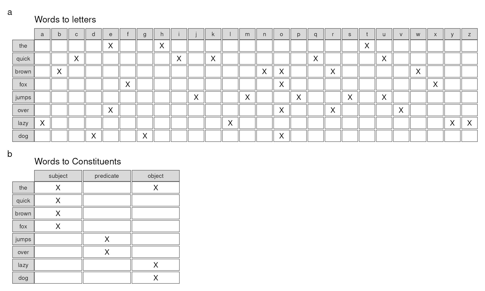

# Coverage and enrichment testing

## Overview

### Setup

\
[`library`](https://rdrr.io/r/base/library.html)`(`[`MultiFactor`](https://minotau-r.github.io/MultiFactor/)`)`\
\
`# Wrangling`\
[`library`](https://rdrr.io/r/base/library.html)`(`[`dplyr`](https://dplyr.tidyverse.org)`)`\
\
`# Plotting`\
[`library`](https://rdrr.io/r/base/library.html)`(`[`ggplot2`](https://ggplot2.tidyverse.org)`)`\
[`library`](https://rdrr.io/r/base/library.html)`(`[`patchwork`](https://patchwork.data-imaginist.com)`)`\
[`library`](https://rdrr.io/r/base/library.html)`(`[`systemfonts`](https://github.com/r-lib/systemfonts)`)`\
[`library`](https://rdrr.io/r/base/library.html)`(`[`ragg`](https://ragg.r-lib.org)`)`\
\
`# Load demo data`\
[`set.seed`](https://rdrr.io/r/base/Random.html)`(``2612``)`\
`fox`` ``<-`` `[`quickbrownfox`](https://minotau-r.github.io/MultiFactor/reference/quickbrownfox.md)`(``)`\
\
`# Define utility function`\
`split_to_letters`` ``<-`` ``function``(``x``)`` `[`unique`](https://rdrr.io/r/base/unique.html)`(`\
`  `[`unlist`](https://rdrr.io/r/base/unlist.html)`(`` `\
`    `[`strsplit`](https://rdrr.io/r/base/strsplit.html)`(`` `[`gsub`](https://rdrr.io/r/base/grep.html)`(``" "``, ``""``, ``x``)``, split ``=`` ``""`` ``)``, `\
`    recursive ``=`` ``TRUE``, use.names ``=`` ``FALSE`\
`  ``)`\
`  ``)`

#### Example Dataset: The Quick Brown Fox

\
[`levels`](https://rdrr.io/r/base/levels.html)`(``fox``)`\
`#> $letter`\
`#>  [1] "a" "b" "c" "d" "e" "f" "g" "h" "i" "j" "k" "l" "m" "n" "o" "p" "q" "r" "s"`\
`#> [20] "t" "u" "v" "w" "x" "y" "z"`\
`#> `\
`#> $word`\
`#> [1] "brown" "dog"   "fox"   "jumps" "lazy"  "over"  "quick" "the"  `\
`#> `\
`#> $constituent`\
`#> [1] "object"    "predicate" "subject"  `\
`#> `\
`#> $sentence`\
`#> [1] "complete pangram"`\
\
[`as.matrix`](https://rdrr.io/r/base/matrix.html)`(``fox``$``letter2word``)`\
`#> 26 x 8 sparse Matrix of class "ngCMatrix"`\
`#>       word`\
`#> letter brown dog fox jumps lazy over quick the`\
`#>      a     .   .   .     .    |    .     .   .`\
`#>      b     |   .   .     .    .    .     .   .`\
`#>      c     .   .   .     .    .    .     |   .`\
`#>      d     .   |   .     .    .    .     .   .`\
`#>      e     .   .   .     .    .    |     .   |`\
`#>      f     .   .   |     .    .    .     .   .`\
`#>      g     .   |   .     .    .    .     .   .`\
`#>      h     .   .   .     .    .    .     .   |`\
`#>      i     .   .   .     .    .    .     |   .`\
`#>      j     .   .   .     |    .    .     .   .`\
`#>      k     .   .   .     .    .    .     |   .`\
`#>      l     .   .   .     .    |    .     .   .`\
`#>      m     .   .   .     |    .    .     .   .`\
`#>      n     |   .   .     .    .    .     .   .`\
`#>      o     |   |   |     .    .    |     .   .`\
`#>      p     .   .   .     |    .    .     .   .`\
`#>      q     .   .   .     .    .    .     |   .`\
`#>      r     |   .   .     .    .    |     .   .`\
`#>      s     .   .   .     |    .    .     .   .`\
`#>      t     .   .   .     .    .    .     .   |`\
`#>      u     .   .   .     |    .    .     |   .`\
`#>      v     .   .   .     .    .    |     .   .`\
`#>      w     |   .   .     .    .    .     .   .`\
`#>      x     .   .   |     .    .    .     .   .`\
`#>      y     .   .   .     .    |    .     .   .`\
`#>      z     .   .   .     .    |    .     .   .`

#### Calculate coverage

We’ll need to generate some collection of letters as input data.

\
`input`` ``<-`` ``split_to_letters``(``"some collection of letters"``)`\
\
`input`\
`#>  [1] "s" "o" "m" "e" "c" "l" "t" "i" "n" "f" "r"`

We can use the
[`weave_coverage()`](https://minotau-r.github.io/MultiFactor/reference/weave_coverage.md)
function to calculate to what degree the input letters cover the words
in our data set. This function behaves similarly to
[`weave()`](https://minotau-r.github.io/MultiFactor/reference/weave-generic.md)
but comes with an additional argument, `.data`. For now, let’s plug in
our input letters:

\
`res`` ``<-`` `[`weave_coverage`](https://minotau-r.github.io/MultiFactor/reference/weave_coverage.md)`(`\
`    x ``=`` ``fox``, .path ``=`` ``letter`` ``~`` ``word``, .data ``=`` ``input`\
`)`\
\
[`as.data.frame`](https://rdrr.io/r/base/as.data.frame.html)`(``res``)`\
`#>    letter  word observed set_count set_size  coverage complete`\
`#> 1       t   the     TRUE         2        3 0.6666667    FALSE`\
`#> 2       h   the    FALSE         2        3 0.6666667    FALSE`\
`#> 3       e   the     TRUE         2        3 0.6666667    FALSE`\
`#> 4       q quick    FALSE         2        5 0.4000000    FALSE`\
`#> 5       u quick    FALSE         2        5 0.4000000    FALSE`\
`#> 6       i quick     TRUE         2        5 0.4000000    FALSE`\
`#> 7       c quick     TRUE         2        5 0.4000000    FALSE`\
`#> 8       k quick    FALSE         2        5 0.4000000    FALSE`\
`#> 9       b brown    FALSE         3        5 0.6000000    FALSE`\
`#> 10      r brown     TRUE         3        5 0.6000000    FALSE`\
`#> 11      o brown     TRUE         3        5 0.6000000    FALSE`\
`#> 12      w brown    FALSE         3        5 0.6000000    FALSE`\
`#> 13      n brown     TRUE         3        5 0.6000000    FALSE`\
`#> 14      f   fox     TRUE         2        3 0.6666667    FALSE`\
`#> 15      o   fox     TRUE         2        3 0.6666667    FALSE`\
`#> 16      x   fox    FALSE         2        3 0.6666667    FALSE`\
`#> 17      j jumps    FALSE         2        5 0.4000000    FALSE`\
`#> 18      u jumps    FALSE         2        5 0.4000000    FALSE`\
`#> 19      m jumps     TRUE         2        5 0.4000000    FALSE`\
`#> 20      p jumps    FALSE         2        5 0.4000000    FALSE`\
`#> 21      s jumps     TRUE         2        5 0.4000000    FALSE`\
`#> 22      o  over     TRUE         3        4 0.7500000    FALSE`\
`#> 23      v  over    FALSE         3        4 0.7500000    FALSE`\
`#> 24      e  over     TRUE         3        4 0.7500000    FALSE`\
`#> 25      r  over     TRUE         3        4 0.7500000    FALSE`\
`#> 26      l  lazy     TRUE         1        4 0.2500000    FALSE`\
`#> 27      a  lazy    FALSE         1        4 0.2500000    FALSE`\
`#> 28      z  lazy    FALSE         1        4 0.2500000    FALSE`\
`#> 29      y  lazy    FALSE         1        4 0.2500000    FALSE`\
`#> 30      d   dog    FALSE         1        3 0.3333333    FALSE`\
`#> 31      o   dog     TRUE         1        3 0.3333333    FALSE`\
`#> 32      g   dog    FALSE         1        3 0.3333333    FALSE`

Now, let’s use a second set of letters that are explicitly part of the
sentence:

\
`input`` ``<-`` ``split_to_letters``(``"jumps over"``)`\
\
`input`\
`#> [1] "j" "u" "m" "p" "s" "o" "v" "e" "r"`

\
`res`` ``<-`` `[`weave_coverage`](https://minotau-r.github.io/MultiFactor/reference/weave_coverage.md)`(`\
`    x ``=`` ``fox``, .path ``=`` ``letter`` ``~`` ``word``, .data ``=`` ``input`\
`)`\
\
[`as.data.frame`](https://rdrr.io/r/base/as.data.frame.html)`(``res``)`\
`#>    letter  word observed set_count set_size  coverage complete`\
`#> 1       t   the    FALSE         1        3 0.3333333    FALSE`\
`#> 2       h   the    FALSE         1        3 0.3333333    FALSE`\
`#> 3       e   the     TRUE         1        3 0.3333333    FALSE`\
`#> 4       q quick    FALSE         1        5 0.2000000    FALSE`\
`#> 5       u quick     TRUE         1        5 0.2000000    FALSE`\
`#> 6       i quick    FALSE         1        5 0.2000000    FALSE`\
`#> 7       c quick    FALSE         1        5 0.2000000    FALSE`\
`#> 8       k quick    FALSE         1        5 0.2000000    FALSE`\
`#> 9       b brown    FALSE         2        5 0.4000000    FALSE`\
`#> 10      r brown     TRUE         2        5 0.4000000    FALSE`\
`#> 11      o brown     TRUE         2        5 0.4000000    FALSE`\
`#> 12      w brown    FALSE         2        5 0.4000000    FALSE`\
`#> 13      n brown    FALSE         2        5 0.4000000    FALSE`\
`#> 14      f   fox    FALSE         1        3 0.3333333    FALSE`\
`#> 15      o   fox     TRUE         1        3 0.3333333    FALSE`\
`#> 16      x   fox    FALSE         1        3 0.3333333    FALSE`\
`#> 17      j jumps     TRUE         5        5 1.0000000     TRUE`\
`#> 18      u jumps     TRUE         5        5 1.0000000     TRUE`\
`#> 19      m jumps     TRUE         5        5 1.0000000     TRUE`\
`#> 20      p jumps     TRUE         5        5 1.0000000     TRUE`\
`#> 21      s jumps     TRUE         5        5 1.0000000     TRUE`\
`#> 22      o  over     TRUE         4        4 1.0000000     TRUE`\
`#> 23      v  over     TRUE         4        4 1.0000000     TRUE`\
`#> 24      e  over     TRUE         4        4 1.0000000     TRUE`\
`#> 25      r  over     TRUE         4        4 1.0000000     TRUE`\
`#> 26      l  lazy    FALSE         0        4 0.0000000    FALSE`\
`#> 27      a  lazy    FALSE         0        4 0.0000000    FALSE`\
`#> 28      z  lazy    FALSE         0        4 0.0000000    FALSE`\
`#> 29      y  lazy    FALSE         0        4 0.0000000    FALSE`\
`#> 30      d   dog    FALSE         1        3 0.3333333    FALSE`\
`#> 31      o   dog     TRUE         1        3 0.3333333    FALSE`\
`#> 32      g   dog    FALSE         1        3 0.3333333    FALSE`

Notice that the column named `"complete"` marks two partcular words as
complete now.

We can use the [`subset()`](https://rdrr.io/r/base/subset.html) method
for `LinkMap` to automatically filter for complete cases:

\
[`subset`](https://rdrr.io/r/base/subset.html)`(``res``)`\
`#> A MultiFactor::LinkMap data.frame S7_object: 9 rows.`\
`#>   letter  word`\
`#> 1      j jumps`\
`#> 2      u jumps`\
`#> 3      m jumps`\
`#> 4      p jumps`\
`#> 5      s jumps`\
`#> 6      o  over`\
`#> 7      v  over`\
`#> 8      e  over`\
`#> 9      r  over`\
`#> `\
`#> @ levels:   2 variables: `\
`#>  $ letter : 26 Levels: a ... z `\
`#>  $ word   :  8 Levels: brown ... the `\
`#> `\
`#> @ metadata: 5 variables: `\
`#> List of 5`\
`#>  $ observed : logi  TRUE TRUE TRUE TRUE TRUE TRUE ...`\
`#>  $ set_count: int  5 5 5 5 5 4 4 4 4`\
`#>  $ set_size : int  5 5 5 5 5 4 4 4 4`\
`#>  $ coverage : num  1 1 1 1 1 1 1 1 1`\
`#>  $ complete : logi  TRUE TRUE TRUE TRUE TRUE TRUE ...`
